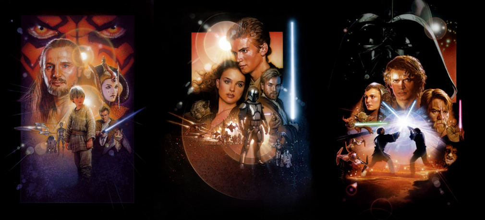

 

# About

This dashboard is a prototype which has been made for a talk presented at the [7th Biennial ACSPRI Social Science Methodology Conference](https://conferences.acspri.org.au/2020/).

It explores topic models generated from IMDB review data for the Star Wars prequel movies (Star Wars Episodes I, II and III).

 

# Code

The code for generating the topic models and this dashboard are publicly available on github: 
 
[https://github.com/socialresearchcentre/text_analytics_w_shiny](https://github.com/socialresearchcentre/text_analytics_w_shiny)

 

# Acknowledgements
 
**Data**
 
The data presented in this dashboard was downloaded from [IEEE](https://ieee-dataport.org/), with the original data being sourced from [IMDB](https://www.imdb.com/)

 

**Packages**

This dashboard would not be possible if not for the following R packages:

- quanteda
- textmineR
- LDAvis
- shiny
- shinydashboard

 

# Contact Us

For any queries feel free to contact us!
 
 
Gabriel Ong: gabriel.ong@srcentre.com.au
 
Paddy Tobias: paddy.tobias@srcentre.com.au

